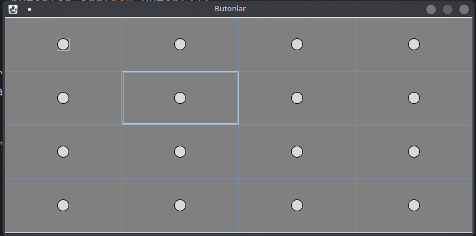
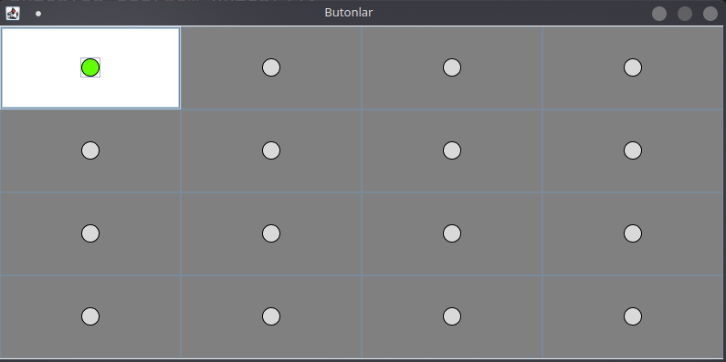
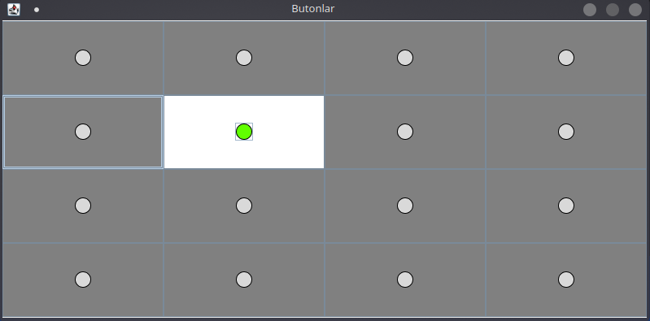

## Buton Uygulaması Ödevi

---
Uygulamanın Calıştırılması
\
`$ cd src/ && javac Main.java && java Main`
---

### Nasıl Çalışıyor?

Uygulamayı çalıştırdıktan sonra karşınıza çıkacak uygulama aşağıdaki gibidir.
\
\


4x4'lük düzlemde 16 tane buton karşımıza çıkıyor.

---

Eğer butonlardan herhangi birine tıklarsak tıklanan butonun görünümünün
aşağıdaki gibi değiştiği görülmektedir.



---

Eğer başka bir butona basarsak o buton da aktif görünüme sahip
olacaktır. Diğer tüm butonlar (daha önce bastığımız buton dahil)
pasif görünüme sahip olacaktır.



---

Her buton hayali bir GraphQL mutationu çalıştırmaktadır. Tüm butonlar
aynı mutationu çalıştırmaktadır ancak gerçek bir kullanım senaryosunda her butonun kendisine özgü
birer mutationa sahip olmalıdır ancak örnek olması sebebiyle her buton aynı hayali mutationu çalıştırmaktadır.
Bu hayali mutationu ve konsol ekranında görebilmekteyiz.


---

### Peki GraphQL Nedir ve Ne İşe Yarar?

GraphQL API'ler (Uygulama Programlama Arayüzü) için geliştirilmiş bir sorgulama dili ve aynı zamanda sorguların var olan
verilerin üzerinde
eksiksiz
gerçekleştirilmesi için geliştirilmiş bir çalışma-zamanıdır (runtime).

Tipik bir REST tabanlı web projesinde çok sayıda
alana ve ilişkiye sahip
birden fazla veri bulunur. Verilerin boyutu ve karmaşıklığı arttıkça bu veriler üzerinde çalıştırılacak sorguların
verimliliği
de azalmaktadır. Verimliliğin azalmasının yanı sıra sorgulama için geliştirilecek arayüzün de karmaşıklığı verilerin
karmaşıklık
ve boyutuna orantılı olarak artmaktadır. Aynı zamanda bu veriler ile ilgili uygulanacak oluşturma (create), güncelleme (
update) ve silme (delete) işlemleri de verinin ilişkileri ve verinin çalışma mantığına göre değişim göstermekte ve
karmaşıklaşmaktadır. Bu noktada verimli ve yeterli bir sorgulama arayüzü geliştirmek
bir sorgulama arayüzü geliştirmek bir gerekliliktir. Ancak böyle bir şeyi gerçekleştirmek çok zahmetli olacaktır.
Aynı gereklilik farklı REST tabanlı web projelerinde de olacaktır ki farklı projelere göre gereklilikler de
değişmektedir. Tam da bu noktada GraphQL bu gerekliliği daha hızlı bir biçimde gerçekleştirmemize olanak sağlar ve
böylelikle API gereksinimlerini daha hızlı bir biçimde gerçekleştirme olanağına sahip oluruz.

GraphQL farklı dillerde geliştirilen web projelerine entegre edilebilir ve yukarıda bahsedilen zaman ve zahmet
sarfiyatını
önemli ölçüde azaltabilir.

GraphQL karmaşık sorguların ek zaman ve zahmet gerektirmeden oluşturulmasına imkan tanır.

### Kavramlar

**Type (Tip) :** Tipleri farklı türdeki verileri birbirlerinden ayırt etmek için kullanır ve tanımlarız.

**Field (Alan) :** Bir veri tipinin kendine has özelliklerini belirten ve belirli bir tipte veri tutan alanları (field)
vardır.

**Query (Sorgu) :** Sunucudan, istenilen biçimdeki ve içinde veri olan yanıtı tanımlamak için kullanılan spesifik
istektir.

### Kısaca Kullanımı

API geliştiricisi istemcinin üzerinde sorgu ve mutasyon gerçekleştirebileceği veri türlerini ve bahsi geçen sorgu ve
mutasyonları
tanımlamak için GraphQL şeması oluşturur. GraphQL şeması nesne
tiplerinin, sorguların ve mutasyonların tanımından oluşur. Bu tanımlar belirli tipteki nesnelerin
hangi alanlara sahip olduğunu, hangi veri tipinin sorgulanabileceğini, nasıl sorguların kullanılacağını ve
hangi durumlarda sorgulanabileceğini belirtir. Ayrıca geliştirici sorguları (query) ve mutasyonları (mutation) şemada
belirtir. Belirtilen sorgu ve mutasyonlar geliştirici tarafından
çözücü (resolver) denilen fonksiyonlarla ilişkilendirilir. GraphQL tanımı
yapılmış sorgu ve mutasyonları gerçekleştirmek için çözücülere ihtiyaç duyar.

İstemci ya da istemci geliştiricisi de API geliştiricisinin tanımladığı şema dahilinde kendi amacına uygun bir biçimde
sorgu ve mutasyonları kullanabilir.

Ornek bir GraphQL şeması aşağıdaki gibidir.

```graphql
type User {
    id: ID!
    username: String
    first_name: String
    last_name: String
    full_name: String
}


type Notification {
    id: ID
    date: Date
    type: String
}


scalar Url
scalar Date

type Query {
    User(id: ID!): User
    Notifications(limit: Int): [Notification]
}
```

Örnek bir GraphQL sorgusu aşağıdaki gibidir.

```graphql
# Not : Bu sorgu semada belirtilmis bir sorgudur.
query GetFruitPrices {
    fruits {
        price
    }
}
```

Örnek bir GraphQL mutationu aşağıdaki gibidir.

```graphql
# Not : Bu mutation semada belirtilmis bir mutationdur.
mutation {
    insert_mutation_ornek(objects: [{ ozellik: "Ozellik Degeri" }]) {
        returning {
            id
        }
    }
}

```

### GraphQL Avantajları

* GraphQL sorguları tek bir sorguda gerçekleştirilir. İstemci sorgusunda istediği verileri alır ve istemci sorgusu
  backend server tarafında tek bir sorguda gerçekleştirilir.
* Eksiksiz ve kesinlik ile tanımlanmış veri tipleri istemci ile sunucu arasında sağlıklı iletişim kurulmasını sağlar.
* GraphQL için oluşturulmuş açık kaynak kodlu birçok eklenti var olup bu eklentiler herhangi bir REST API tarafından
  gerçekleştirilemeyecek bir çok işlevi gerçekleştirebilir.
* GraphQL projenin mimarisinden bağımsız olarak entegre edilebilmektedir.

### GraphQL Dezavantajları

* GraphQL veri sorgulama işlemlerinin yükünün büyük çoğunluğunu sunucu tarafına yüklemektedir.
* REST API geliştiricileri için ek öğrenme yükü.
* Önbellekleme GraphQL'de daha karmaşık bir işlemdir.
* Geliştirici ek olarak işlevsel ve yürütülebilir bir GraphQL şeması oluşturma yükünü de sırtlamış olur.


